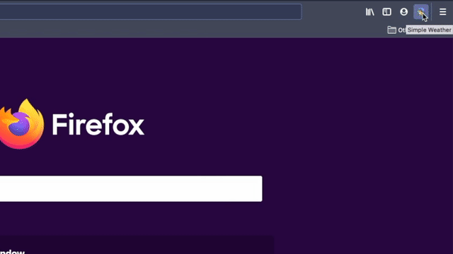

# Simple Weather

## About

Simple Weather is a Firefox add-on that enables you to easily check the weather with one toolbar click. The weather data is provided by [Open Weather Map API](https://openweathermap.org/).

## Quick start

1. Install and enable the add-on;
2. [Create a free account on Open Weather Map](https://home.openweathermap.org/users/sign_up);
3. [Copy your OWM API key](https://home.openweathermap.org/api_keys);
4. Open the add-on settings page and insert your API key.

## License

Project is licensed under the [Mozilla Public License](./LICENSE).

The app icon was produced by [Yoji Inata](https://iconarchive.com/artist/yoji.html)
